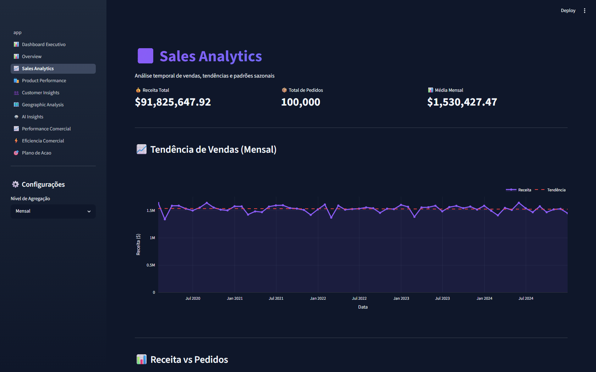
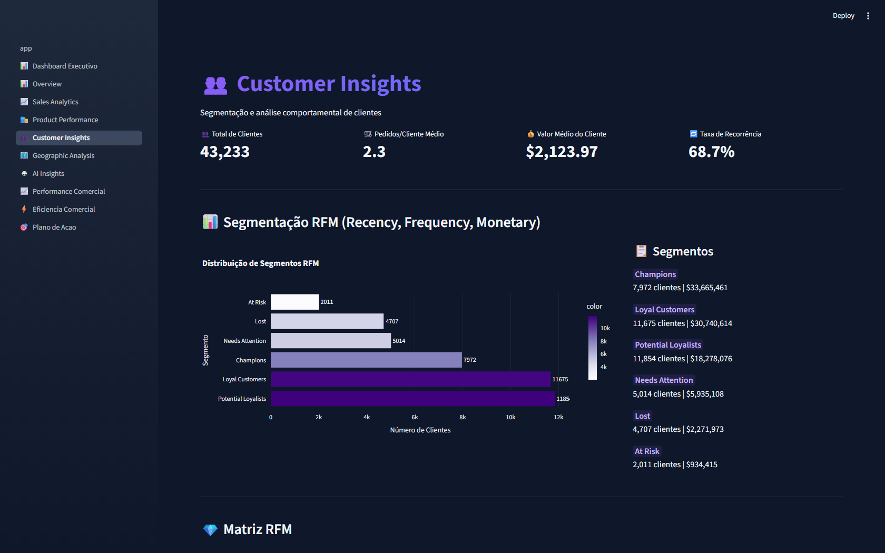

# 📊 Sales Analytics — AI-Powered Sales Dashboard

> Turn your sales spreadsheet into a decision-making cockpit: **KPIs, interactive charts and AI-generated action plans** — in seconds, right in the browser, nothing to install.

🔗 **Live demo:** _deploying on Streamlit Cloud — link coming soon_


---

## 🎬 See it in action

**Executive Dashboard** — the numbers a manager needs, on the very first screen:


| Sales overview | Product performance |
|:---:|:---:|
|  |  |

**Geographic sales distribution:**


| Sales time-series analysis | Customer segmentation (RFM) |
|:---:|:---:|
|  |  |

---

## 🎯 The problem it solves

Small and mid-sized businesses pile up sales spreadsheets that **nobody actually analyzes** — the numbers exist, but they never turn into decisions. This dashboard takes that data and answers, instantly: *what's selling, where money is stuck, and what to do about it.*

## ✨ What it does

- 📈 **Automatic KPIs** — revenue, average ticket, margin, ROI and conversion rate, all computed for you
- 🗂️ **10 analysis pages** — executive, sales, products, customers (RFM/clustering), geographic, commercial performance and efficiency
- 📊 **Interactive charts** (Plotly) — filter, zoom, hover
- 🗺️ **Geographic analysis** — sales map by country/region
- 🤖 **AI insights (Google Gemini)** — diagnosis and action plan in a manager's language, not a developer's
- 🎯 **ROI-driven action plan** — prioritized recommendations and a 90-day roadmap
- 📄 **PDF export** — a report ready to present

## 🛠️ Tech stack

`Python` · `Streamlit` · `Plotly` · `Pandas` · `Scikit-learn` · `Google Gemini` · `LangChain`

## 🚀 Run it locally

```bash
# 1. Install dependencies
pip install -r requirements.txt

# 2. Run the app
streamlit run app.py

# 3. Open in your browser
# http://localhost:8501
```

On the **🤖 AI Insights** page, paste your free [Google Gemini API key](https://aistudio.google.com/app/apikey) to unlock the AI analysis. All other pages work without a key.

## 📊 About the data

The sample dataset (`Amazon.csv`) ships with **100k transactions** — orders, customers, products, amounts, discounts and payment methods — so you can see the dashboard working before plugging in your own data.

---

## 💬 Need a dashboard like this for your business?

I build custom **BI dashboards**, **automation** and **applied AI** solutions for small and mid-sized businesses.

- 🐙 GitHub: [github.com/RTzinh](https://github.com/RTzinh)
- 📩 Email: _your-email-here_
- 💼 LinkedIn: _your-linkedin-here_
