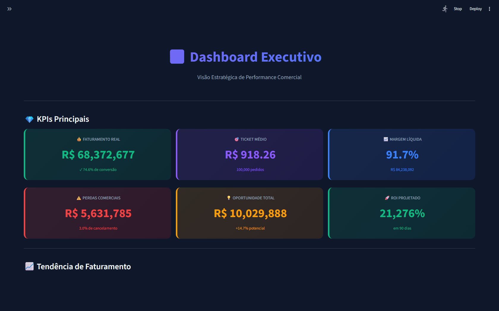
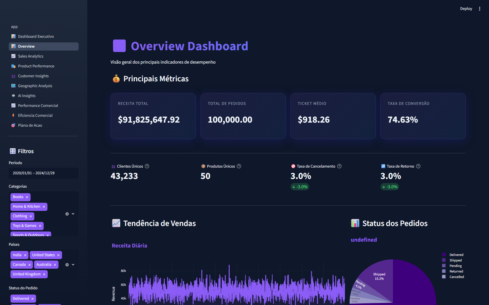
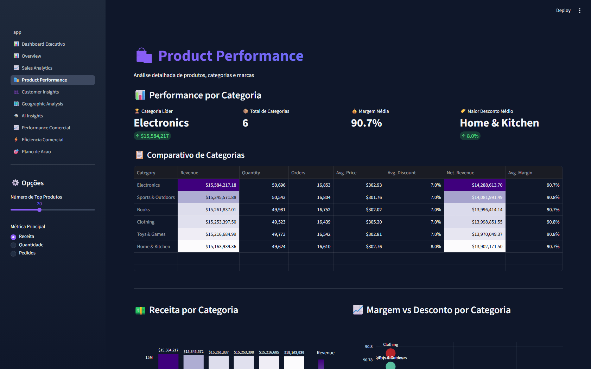
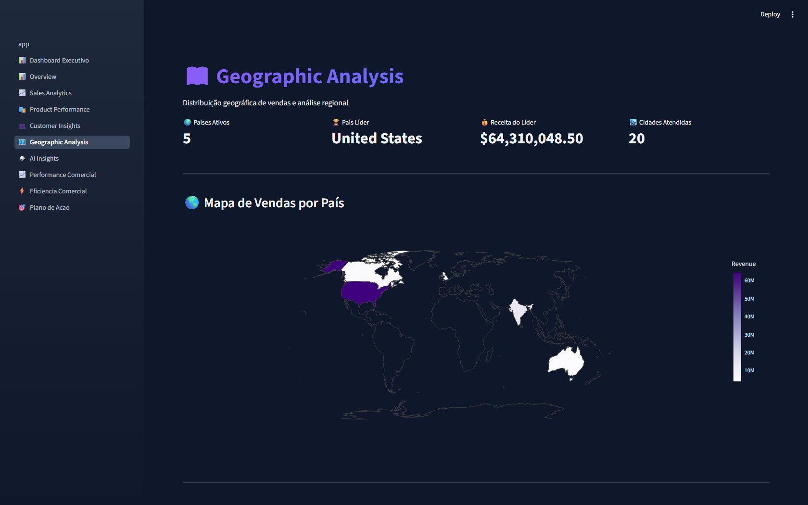

# 📊 Sales Analytics — Dashboard de Vendas com IA

> Transforme sua planilha de vendas em um painel de decisões: **KPIs, gráficos interativos e planos de ação gerados por IA** — em segundos, direto no navegador, sem instalar nada.

🔗 **Demo ao vivo:** _publicando no Streamlit Cloud — link em breve_


---

## 🎬 Veja funcionando

**Dashboard Executivo** — os números que o gestor precisa, na primeira tela:



| Visão geral de vendas | Performance por produto |
|:---:|:---:|
|  |  |

**Distribuição geográfica das vendas:**



---

## 🎯 O problema que ele resolve

Pequenos e médios negócios acumulam planilhas de vendas que **ninguém analisa de verdade** — os números existem, mas não viram decisão. Este dashboard pega esses dados e responde, na hora: *o que está vendendo, onde está o dinheiro parado e o que fazer a respeito.*

## ✨ O que ele faz

- 📈 **KPIs automáticos** — faturamento, ticket médio, margem, ROI e taxa de conversão calculados sozinhos
- 🗂️ **10 páginas de análise** — executiva, vendas, produtos, clientes (RFM/clustering), geográfica, performance e eficiência comercial
- 📊 **Gráficos interativos** (Plotly) — filtre, dê zoom, passe o mouse
- 🗺️ **Análise geográfica** — mapa de vendas por país/região
- 🤖 **Insights por IA (Google Gemini)** — diagnóstico e plano de ação em linguagem de gestor, não de programador
- 🎯 **Plano de ação com ROI** — recomendações priorizadas e cronograma de 90 dias
- 📄 **Exportação em PDF** — relatório pronto para apresentar

## 🛠️ Tecnologias

`Python` · `Streamlit` · `Plotly` · `Pandas` · `Scikit-learn` · `Google Gemini` · `LangChain`

## 🚀 Como rodar localmente

```bash
# 1. Instale as dependências
pip install -r requirements.txt

# 2. Rode a aplicação
streamlit run app.py

# 3. Acesse no navegador
# http://localhost:8501
```

Na página **🤖 AI Insights**, cole sua chave gratuita da [API do Google Gemini](https://aistudio.google.com/app/apikey) para liberar a análise por IA. As demais páginas funcionam sem chave.

## 📊 Sobre os dados

O dataset de exemplo (`Amazon.csv`) traz **100 mil transações** com pedidos, clientes, produtos, valores, descontos e métodos de pagamento — pronto para você ver o dashboard funcionando antes de plugar seus próprios dados.

---

## 💬 Precisa de um dashboard assim pro seu negócio?

Crio painéis de **BI**, **automações** e soluções de **IA aplicada** sob medida para pequenas e médias empresas.

- 🐙 GitHub: [github.com/RTzinh](https://github.com/RTzinh)
- 📩 E-mail: _seu-email-aqui_
- 💼 LinkedIn: _seu-linkedin-aqui_
